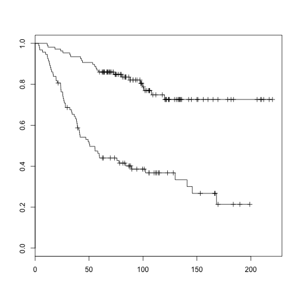

## Libraries and Data
```
source("http://bioconductor.org/biocLite.R")
biocLite("pamr")
biocLite("gplots")
biocLite("multtest")
biocLite("survival")
```

```r
library(survival)
```

```
## Loading required package: splines
```

```r
library(pamr)
```

```
## Loading required package: cluster
```

```r
library(gplots)
```

```
## Loading required package: gtools
```

```
## Loading required package: gdata
```

```
## gdata: read.xls support for 'XLS' (Excel 97-2004) files ENABLED.
```

```
## ```

```
## gdata: read.xls support for 'XLSX' (Excel 2007+) files ENABLED.
```

```
## Attaching package: 'gdata'
```

```
## The following object is masked from 'package:stats':
## 
## nobs
```

```
## The following object is masked from 'package:utils':
## 
## object.size
```

```
## Loading required package: caTools
```

```
## Loading required package: grid
```

```
## Loading required package: KernSmooth
```

```
## KernSmooth 2.23 loaded Copyright M. P. Wand 1997-2009
```

```
## Loading required package: MASS
```

```
## Attaching package: 'gplots'
```

```
## The following object is masked from 'package:stats':
## 
## lowess
```

```r
library(multtest)
```

```
## Loading required package: Biobase
```

```
## Loading required package: BiocGenerics
```

```
## Loading required package: parallel
```

```
## Attaching package: 'BiocGenerics'
```

```
## The following objects are masked from 'package:parallel':
## 
## clusterApply, clusterApplyLB, clusterCall, clusterEvalQ, clusterExport,
## clusterMap, parApply, parCapply, parLapply, parLapplyLB, parRapply,
## parSapply, parSapplyLB
```

```
## The following object is masked from 'package:gdata':
## 
## combine
```

```
## The following object is masked from 'package:stats':
## 
## xtabs
```

```
## The following objects are masked from 'package:base':
## 
## anyDuplicated, as.data.frame, cbind, colnames, duplicated, eval, Filter,
## Find, get, intersect, lapply, Map, mapply, match, mget, order, paste,
## pmax, pmax.int, pmin, pmin.int, Position, rank, rbind, Reduce, rep.int,
## rownames, sapply, setdiff, sort, table, tapply, union, unique, unlist
```

```
## Welcome to Bioconductor
## 
## Vignettes contain introductory material; view with 'browseVignettes()'. To
## cite Bioconductor, see 'citation("Biobase")', and for packages
## 'citation("pkgname")'.
```

```
## Attaching package: 'multtest'
```

```
## The following object is masked from 'package:gplots':
## 
## wapply
```

```
load("./STAT435-VDVdata.RData")
```

---

## Rescale data to zero mean and standard deviation 1

```r
yy <- t(apply(vdv.int, 1, function(x) (x - mean(x))/sd(x)))
yy[yy < -3] <- -3
yy[yy > 3] <- 3
```


---

## Heatmap of clustered data

```r
heatmap(yy, distfun = function(x) as.dist(1 - cor(t(x))), col = c(rgb(0, seq(1, 
    0, l = 25), 0), rgb(seq(0, 1, l = 25), 0, 0)), labRow = "", labCol = "")
```

 


---

## Heatmap of clustered data
- There appears to be approximately 3 major gene clusters (side dendrogram).

- There are four distinct groups of patients (top dendrogram).

---

## Split data into 4 groups
Number of women assigned to each group:

```r
ctint <- cutree(hclust(as.dist(1 - cor(yy))), 4)
table(ctint)
```

```
## ctint
##   1   2   3   4 
##  40  79 114  62
```

This is similar to the number of women assigned to the different intrinsic subtypes:

```r
table(vdv.clin$Intrinsic.Subtype)
```

```
## 
##       Basal        HER2        LumA        LumB Normal-like 
##          53          35         123          69          15
```


---

## Instrinsic subtypes of the four groups

```r
table(vdv.clin$Intrinsic.Subtype, ctint, dnn = c("Subtype", "Group"))
```

```
##              Group
## Subtype        1  2  3  4
##   Basal        1  0 50  2
##   HER2         9  0 24  2
##   LumA         3 65 19 36
##   LumB        27  7 13 22
##   Normal-like  0  7  8  0
```


---

## Relapse Rates

```r
table(vdv.clin$RFS.event, vdv.clin$Intrinsic.Subtype, dnn = c("Relapse rate", 
    "Subtype"))
```

```
##             Subtype
## Relapse rate Basal HER2 LumA LumB Normal-like
##            0    26   17   99   28           7
##            1    27   18   24   41           8
```

```r
table(vdv.clin$RFS.event, ctint, dnn = c("Relapse rate", "Group"))
```

```
##             Group
## Relapse rate  1  2  3  4
##            0 17 67 58 35
##            1 23 12 56 27
```


---

## Death Rates

```r
table(vdv.clin$OS.event, vdv.clin$Intrinsic.Subtype, dnn = c("Death rate", "Subtype"))
```

```
##           Subtype
## Death rate Basal HER2 LumA LumB Normal-like
##          0    28   20  109   46          13
##          1    25   15   14   23           2
```

```r
table(vdv.clin$OS.event, ctint, dnn = c("Death rate", "Group"))
```

```
##           Group
## Death rate  1  2  3  4
##          0 24 73 72 47
##          1 16  6 42 15
```


---

## Relapse & Death
Relapse rates are approximately 50% across all subtypes except Luminal A and B. Luminal B has a high relapse hate and Luminal A a low one. Luminal A also has a very low death rate, as does 'Normal-ike'.

Amongst the 4 groups, group 2 has a very low relapse and death rate.

---

## Singular value decomposition metagene

```r
xx <- svd(yy)
attach(xx)
mg <- svd(yy)$v[, 1]
mg.rnk <- rank(mg)/length(mg)
mg.col <- greenred(length(mg))[rank(mg)]
ord <- order(mg.rnk)
```


---

## Metagene and heatmap

```r
heatmap.2(yy[, ord], trace = "none", scale = "none", Colv = T, Rowv = T, ColSideColors = mg.col[ord], 
    col = greenred(50), labCol = paste("Sample", 1:ncol(yy))[ord], labRow = paste("Gene", 
        1:ncol(yy)))
```

 


---

## Boxplot showing distribution of metagene values accross intrinsic subtype

```r
boxplot(mg.rnk ~ vdv.clin$Intrinsic.Subtype, xlab = "Intrinsic.Subtype", ylab = "Metagene Value")
```

 

---

## Boxplot showing distribution of metagene values accross ER status

```r
boxplot(mg.rnk ~ vdv.clin$ER, xlab = "ER", ylab = "Metagene Value")
```

 

---

## Boxplot showing distribution of metagene values accross grade

```r
boxplot(mg.rnk ~ vdv.clin$Grade, xlab = "Grade", ylab = "Metagene Value")
```

 


---

## Information
- Subtype and estrogen receptor status appear to gave the greatest impact on proliferation, followed by grade. Tumour grade shows an obvious upward trend, as expected, but the ranges are very broad.

---

## Classification and survival analysis
Split van de Vijver data into a training set and test set.

```r
tr <- sample(seq(1, 295), 200)
ts <- setdiff(1:295, tr)
tr.dat <- list()
tr.dat$x <- vdv.genes[, tr]
tr.dat$y <- vdv.clin$RFS.event[tr]
ts.dat <- list()
ts.dat$x <- vdv.genes[, ts]
ts.dat$y <- vdv.clin$RFS.event[ts]
```


---

## Relapse and non-relapse class between training and test sets

```r
table(tr.dat$y)
```

```
## 
##   0   1 
## 117  83
```

```r
table(ts.dat$y)
```

```
## 
##  0  1 
## 60 35
```


---

## PAMR and CV plot

```r
train <- pamr.train(tr.dat)
cv <- pamr.cv(train, tr.dat)
```


```r
pamr.plotcv(cv)
```

 


---

## Geneplots

```r
pamr.geneplot(train, tr.dat, threshold = 2.6)
```

 


---

## Predictions

```r
pred.ts <- pamr.predict(train, ts.dat$x, threshold = 1.5)
table(ts.dat$y, pred.ts)
```

```
##    pred.ts
##      0  1
##   0 43 17
##   1 12 23
```

```r
pred.tr <- pamr.predict(train, tr.dat$x, threshold = 1.5)
table(tr.dat$y, pred.tr)
```

```
##    pred.tr
##      0  1
##   0 84 33
##   1 23 60
```


---
  
## Fisher test on test set

```r
fisher.test(table(ts.dat$y, pred.ts))
```

```
## 
## 	Fisher's Exact Test for Count Data
## 
## data:  table(ts.dat$y, pred.ts)
## p-value = 0.0005305
## alternative hypothesis: true odds ratio is not equal to 1
## 95 percent confidence interval:
##   1.815 13.138
## sample estimates:
## odds ratio 
##      4.759
```


---
  
## Fisher test on training set

```r
fisher.test(table(tr.dat$y, pred.tr))
```

```
## 
## 	Fisher's Exact Test for Count Data
## 
## data:  table(tr.dat$y, pred.tr)
## p-value = 7.979e-10
## alternative hypothesis: true odds ratio is not equal to 1
## 95 percent confidence interval:
##   3.396 13.078
## sample estimates:
## odds ratio 
##      6.568
```


---

## Sensitivity and specificty
Test set


- Sensitivity: 65.7143 %
- Specificity: 71.6667 %
- PPV: 57.5 %
- NPV: 78.1818 %

Training set


- Sensitivity: 72.2892 %
- Specificity: 71.7949 %
- PPV: 64.5161 %
- NPV: 78.5047 %

As expected the training set performs much better, as it was used to create the predictor.

---

## Survival analysis

```r
tr.clin <- vdv.clin[tr, ]
ts.clin <- vdv.clin[ts, ]
```


---

## Survival plot of training set

```r
plot(survfit(Surv(tr.clin$RFS.months, tr.clin$RFS.event) ~ pred.tr))
```

 


---

## Survival plot of training set

```r
survdiff(Surv(tr.clin$RFS.months, tr.clin$RFS.event) ~ pred.tr)
```

```
## Call:
## survdiff(formula = Surv(tr.clin$RFS.months, tr.clin$RFS.event) ~ 
##     pred.tr)
## 
##             N Observed Expected (O-E)^2/E (O-E)^2/V
## pred.tr=0 107       23     52.1      16.2      44.1
## pred.tr=1  93       60     30.9      27.4      44.1
## 
##  Chisq= 44.1  on 1 degrees of freedom, p= 3.09e-11
```


---

## Survival plot of test set

```r
plot(survfit(Surv(ts.clin$RFS.months, ts.clin$RFS.event) ~ pred.ts))
```

 


---

## Survival plot of test set

```r
survdiff(Surv(ts.clin$RFS.months, ts.clin$RFS.event) ~ pred.ts)
```

```
## Call:
## survdiff(formula = Surv(ts.clin$RFS.months, ts.clin$RFS.event) ~ 
##     pred.ts)
## 
##            N Observed Expected (O-E)^2/E (O-E)^2/V
## pred.ts=0 55       12     24.2      6.18      20.7
## pred.ts=1 40       23     10.8     13.91      20.7
## 
##  Chisq= 20.7  on 1 degrees of freedom, p= 5.43e-06
```


---

## Survival plot using Luminal A subtype predictor

```r
int.pred <- ifelse(vdv.clin$Intrinsic.Subtype == "LumA", 0, 1)
table(int.pred, vdv.clin$RFS.event)
```

```
##         
## int.pred  0  1
##        0 99 24
##        1 78 94
```


---

## Survival plot using Luminal A subtype predictor

```r
fisher.test(table(int.pred, vdv.clin$RFS.event))
```

```
## 
## 	Fisher's Exact Test for Count Data
## 
## data:  table(int.pred, vdv.clin$RFS.event)
## p-value = 1.012e-09
## alternative hypothesis: true odds ratio is not equal to 1
## 95 percent confidence interval:
##  2.823 8.894
## sample estimates:
## odds ratio 
##      4.943
```


---

## Survival plot using Luminal A subtype predictor

```r
plot(survfit(Surv(vdv.clin$RFS.months, vdv.clin$RFS.event) ~ int.pred))
```

 


---

## Survival plot using Luminal A subtype predictor

```r
survdiff(Surv(vdv.clin$RFS.months, vdv.clin$RFS.event) ~ int.pred)
```

```
## Call:
## survdiff(formula = Surv(vdv.clin$RFS.months, vdv.clin$RFS.event) ~ 
##     int.pred)
## 
##              N Observed Expected (O-E)^2/E (O-E)^2/V
## int.pred=0 123       24     56.3      18.5      35.5
## int.pred=1 172       94     61.7      16.9      35.5
## 
##  Chisq= 35.5  on 1 degrees of freedom, p= 2.5e-09
```


---

## Sensitivity and specificity of Luminal A subtype predictor
## Sensitivity and specificty


- Sensitivity: 54.6512 %
- Specificity: 80.4878 %
- PPV: 79.661 %
- NPV: 55.9322 %

The Luminal subtype predictor perorms much better than the predictor produced by PAMR. This is to be expected since the subtype has a real biological meaning and therefore related far better to the data collected than the PAMR predictor, which is based off a sample of the total data collected.

---
